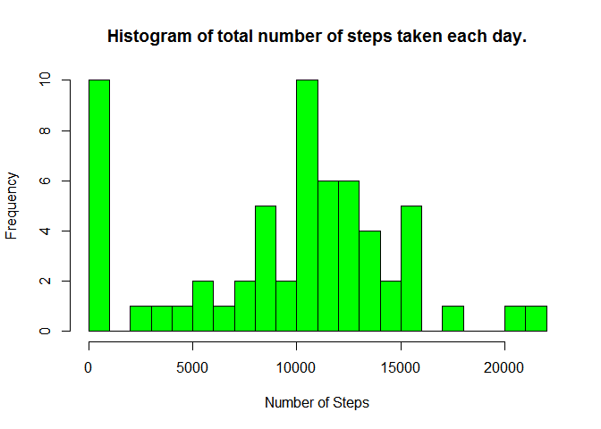
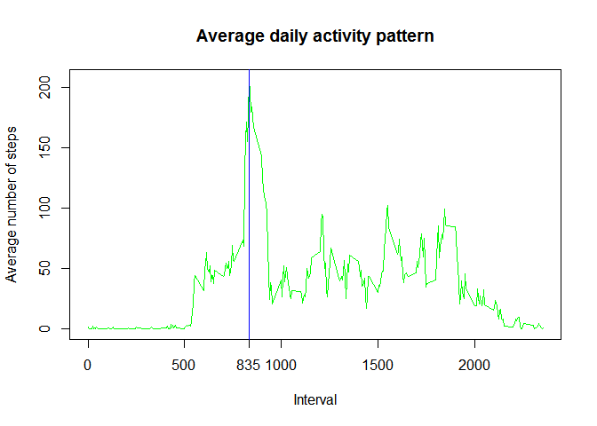
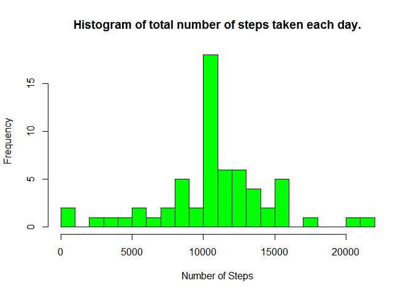
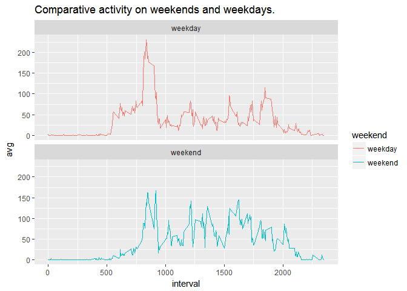

# Person Activity Analysis
Niranjan  
June 6, 2017  

## Synopsis

This assignment makes use of data from a personal activity monitoring device. This device collects data at 5 minute intervals through out the day. The data consists of two months of data from an anonymous individual collected during the months of October and November, 2012 and include the number of steps taken in 5 minute intervals each day.

## Data Set

The data for this assignment can be downloaded from the course web site:

Dataset: [Activity monitoring data [52K]](https://d396qusza40orc.cloudfront.net/repdata%2Fdata%2Factivity.zip)
The variables included in this dataset are:  

steps: Number of steps taking in a 5-minute interval (missing values are coded as NA)  
date: The date on which the measurement was taken in YYYY-MM-DD format  
interval: Identifier for the 5-minute interval in which measurement was taken  
The dataset is stored in a comma-separated-value (CSV) file and there are a total of 17,568 observations in this dataset.


## Monitoring activities Data Set

#### Loading the data set  


Imports


Loading the data set.

```r
df <- read.csv('activity.csv')
dim(df)
```

```
## [1] 17568     3
```

```r
str(df)
```

```
## 'data.frame':	17568 obs. of  3 variables:
##  $ steps   : int  NA NA NA NA NA NA NA NA NA NA ...
##  $ date    : Factor w/ 61 levels "2012-10-01","2012-10-02",..: 1 1 1 1 1 1 1 1 1 1 ...
##  $ interval: int  0 5 10 15 20 25 30 35 40 45 ...
```
#### Convering strings of dates to date objects

```r
df$date <- as.Date(df$date, format='%Y-%m-%d')
str(df)
```

```
## 'data.frame':	17568 obs. of  3 variables:
##  $ steps   : int  NA NA NA NA NA NA NA NA NA NA ...
##  $ date    : Date, format: "2012-10-01" "2012-10-01" ...
##  $ interval: int  0 5 10 15 20 25 30 35 40 45 ...
```

#### Plots
##### Total steps taken each day per-day.

```r
#Sum all the steps taken each day.
steps_dates = tapply(df$steps, df$date, sum, na.rm = TRUE) 
steps_dates = as.list(steps_dates)
hist(unname(unlist(steps_dates)), 
        breaks = seq(from=0, to=22000, by=1000),
        xlab = "Number of Steps", 
        main = "Histogram of total number of steps taken each day.",
        col = 'green')
```

<!-- -->

##### Mean steps taken each day are

```r
print(paste("Mean Steps taken per day are", mean(unname(unlist(steps_dates)))))
```

```
## [1] "Mean Steps taken per day are 9354.22950819672"
```

##### Median steps taken each day

```r
print(paste("Median Steps taken per day are", median(unname(unlist(steps_dates)))))
```

```
## [1] "Median Steps taken per day are 10395"
```
## Average daily activity pattern

```r
by_int <- aggregate(steps ~ interval, FUN = mean, data = df, na.rm = TRUE)
plot(by_int$interval, by_int$steps, type = 'l', col='green', xlab = "Interval", ylab = "Average number of steps", main = "Average daily activity pattern")

axis(1, at = c(835))

abline(v=by_int$interval[which.max(by_int$steps)], col='blue')
```

<!-- -->

So from the above graph it is clear that, at around 8.35 am the maximum average activity is recorded.

## Tackling the missing values


```r
print(sapply(df, function(x) {mean(is.na(x))*100}))
```

```
##    steps     date interval 
## 13.11475  0.00000  0.00000
```
##### *So, we have 13% missing values into the steps column.*


##### *Imputing the missing values*

```r
df1 <- df %>%
        group_by(interval) %>%
        summarise(avg = mean(steps, na.rm = TRUE)) %>%
        merge(df, ., all.x = TRUE) %>%
        mutate(steps = ifelse(is.na(steps) == TRUE, avg, steps)) %>%
        select(-avg)

#Sum all the steps taken each day.
steps_dates = tapply(df1$steps, df1$date, sum, na.rm = TRUE) 
steps_dates = as.list(steps_dates)
hist(unname(unlist(steps_dates)), 
        breaks = seq(from=0, to=22000, by=1000),
        xlab = "Number of Steps", 
        main = "Histogram of total number of steps taken each day.",
        col = 'green')
```

<!-- -->
#### The new mean and medians after imputing the values.

```r
by_date <- df1 %>%
            group_by(date) %>%
            summarise(total = sum(steps))

print(paste("Mean Steps taken per day are", mean(by_date$total)))
```

```
## [1] "Mean Steps taken per day are 10766.1886792453"
```

```r
print(paste("Median Steps taken per day are", median(by_date$total)))
```

```
## [1] "Median Steps taken per day are 10766.1886792453"
```
Looking to the above results the mean and median steps taken, we can say that,
the new mean and the median are different from that of the old mean and median.
 

## Number of steps taken on the weekends and weekdays. 
 
 

```r
df1$day <- weekdays(df1$date, abbreviate = FALSE)
weekends <- c("Saturday", "Sunday")
df1 <- mutate(df1, weekend = ifelse(day %in% weekends, "weekend", "weekday"))
df1 <- select(df1, -day)
df2 <- df1 %>% group_by(interval, weekend) %>% summarise(avg = mean(steps))

g <- ggplot(df2, aes(interval, avg, color = weekend))
g + geom_line() + facet_wrap(~ weekend, ncol = 1) + labs(title = "Comparative activity on weekends and weekdays.")
```

<!-- -->


The above graph displays the activity rates between the weekdays and weekends. And these activity levels are different.
